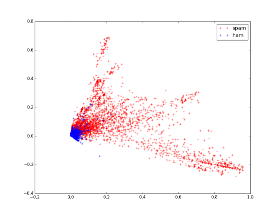

classifier_comparison
=====================

Comparison of several sklearn classifiers as applied to comment spam

To draw some plots:

    make plot

To display corpus using PCA:

	make pca
	
This will plot an image like this:

To perform grid search with SGD classifier:

    make grid_search

Example output of grid search (with AUC scoring):

    python grid_search.py \
        --data_dir ~/dev/py-nlp/var/corpora/livefyre
    2 documents
    2 categories

    Performing grid search...
    pipeline: ['vect', 'tfidf', 'norm', 'clf']
    parameters:
    {'clf__alpha': (0.01, 0.001, 0.0001, 1e-05, 1e-06),
     'clf__l1_ratio': (0.0, 0.1, 0.2, 0.3, 0.4, 0.5),
     'clf__loss': ('hinge', 'log', 'modified_huber')}
    Fitting 3 folds for each of 90 candidates, totalling 270 fits
    [Parallel(n_jobs=-1)]: Done   1 jobs       | elapsed:    2.6s
    [Parallel(n_jobs=-1)]: Done  50 jobs       | elapsed:   37.2s
    [Parallel(n_jobs=-1)]: Done 200 jobs       | elapsed:  2.3min
    [Parallel(n_jobs=-1)]: Done 264 out of 270 | elapsed:  3.0min remaining:    4.1s
    [Parallel(n_jobs=-1)]: Done 270 out of 270 | elapsed:  3.1min finished
    done in 187.420s

    Best score: 0.969
    Best parameters set:
        clf__alpha: 0.0001
        clf__l1_ratio: 0.4
        clf__loss: 'log'

To perform topic extraction:

    make extract_topics
